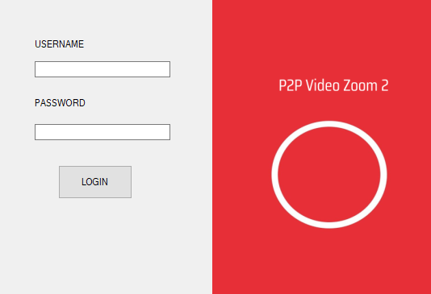
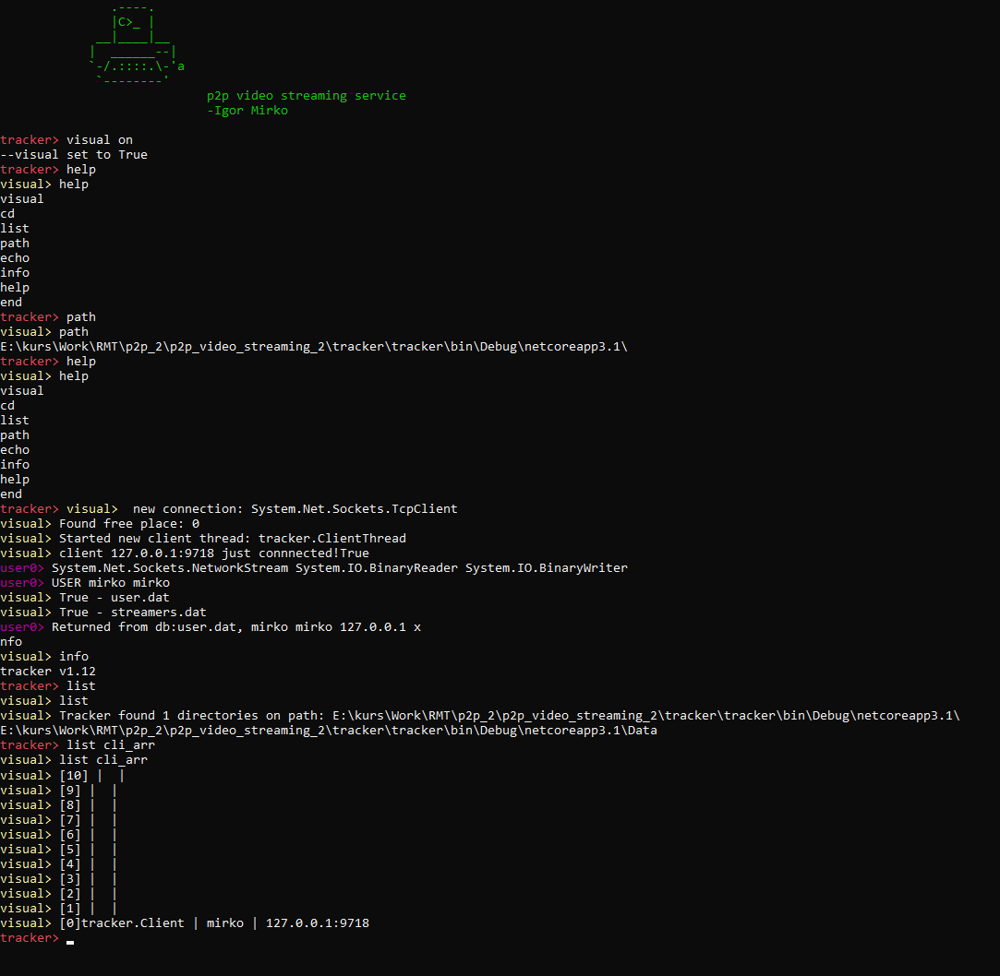

# ZOOM2 - p2p Video Streaming 
University project in course Networking and Telecommunicataions

Consists of two main parts:

## 1.Client


## 2.Tracker


`zoom2` is the easiest way to securely stream videos/webcam/screenshare over internet.

Designed for Windows 10. *Not yet tested on Linux, but we are working on updating it!*

**Usage**
---

```
Usage: <kako pokrenuti trackera> [OPTIONS]

  Securely configure your Mac.
  Developed by Aaron Lichtman -> (Github: alichtman)


Options:
  -lockdown  Set secure configuration without user interaction.
  -v         Display version and author information and exit.
  -help, -h  Show this message and exit.
```

**How to Contribute**
---

1. Fork a repo and create a new branch.
2. Make changes and test
3. Submit Pull Request with comprehensive description of changes

**Acknowledgements**
---

+ [@igornedovic](https://www.github.com/igornedovic).
+ [@mirkonikic](https://www.github.com/mirkonikic)

**Donations**
---

This is free, open-source software. If you'd like to support the development of future projects, or say thanks for this one, you can donate BTC at `To be created`.
